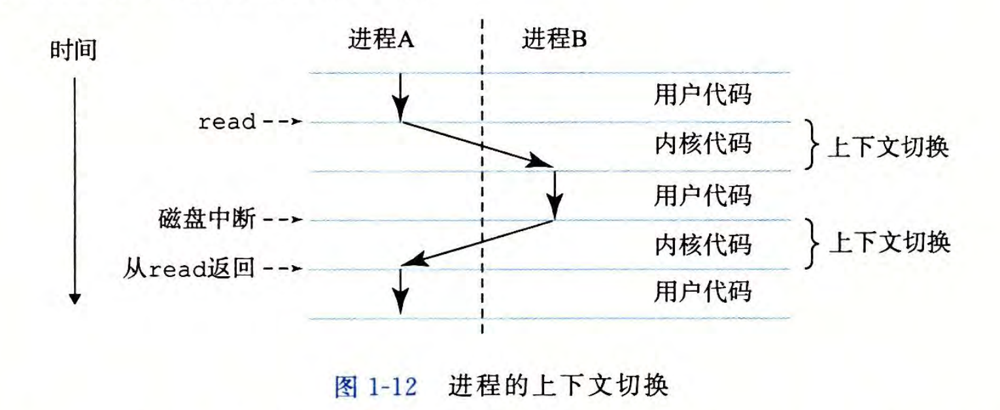

# 计算机系统漫游
计算机系统是由 *硬件* 和 *软件* 组成的

***计算机系统*** 与 ***计算机体系***

## 信息就是位 + 上下文
```C
//hello.c文本文件
#include <stdio.h>

int main(void) {
    printf("Hello, world!\n");
    return 0;
}
```
**位(bit)**：一个0或1，称为位
**字节(byte)**：8个位
**文本文件**：像hello.c这样只由ASCII字符构成的文件，称为文本文件
**二进制文件**：除了文本文件的其他所有文件都称为二进制文件

>C语言的起源故事

## 程序被其他程序翻译成不同的格式

hello.c(文本文件) -*预处理*- hello.i(文本文件) -*编译器*- hello.s(文本文件) -*汇编器*- hello.o + printf.o(二进制文件) -*链接器*- hello.exe(二进制文件)  [Windows]
1. **预处理阶段**：
   · *预处理器(CPP)*将#开头的命令，修改原始的C程序，#include <stdio.h>会读取系统头文件的内容并将它直接插入程序文本中，得到另一个.i文件
2. **编译阶段**
   · *编译器(CCL)* 翻译成汇编语言
3. **汇编阶段**
   · *汇编器(AS)*翻译成机器语言，并将这些指令打包成一种叫做***可重定位目标程序***
4. **链接阶段**
   · hello程序中调用了printf函数，它是每个编译器中都提供的C标准库中的函数，*链接器(LD)*负责处理这两个的合并，最后得到了 ***可执行目标文件***，可以被加载到内存中由系统执行。
> GNU项目的故事

## 了解编译系统如何工作
hello.c程序很简单，没有优化的余地。对于大型程序来说，代码优化的地方很多。
- **优化程序性能**：现代的编译器会尽可能帮我们生成更好的代码，但程序员需要了解机器代码和编译器转化C为机器代码的方式
  1. switch语句是否总比if-else语句高效
  2. 一个函数调用的开销多大
  3. while循环比for循环有效吗
  4. 指针引用比数组索引更有效吗
  5. .....
- **理解链接时出现的错误**：构建大型项目时，程序的链接错误
  1. 链接器无法解析一个引用
  2. 静态变量和全局变量的区别
  3. 在不同的C文件中定义了相同的名字的全局变量会发生什么
  4. 静态库和动态库的区别
  5. ........
- **避免安全漏洞**：缓冲溢出

## 处理器读并解释存在内存中的指令
```shell
linux> ./hello
Hello,world!
linux> 
```
shell是一个命令行解释器。这是在linux执行hello程序，并在屏幕上输出了Hello,world!
### 系统的硬件组成
1.  **总线(bus line)**：贯穿整个系统的电子通道。可以传送定长的**字节块（字：word）**。字中的字节数系统的硬件组成
（**字长**）。32位(4个字节)/64位(8个字节)
2. **I/O设备**：输入/输出设备(将概念抽象的范围更大一点，不仅仅局限于键鼠)。
每个I/O设备通过一个**控制器** 和 **适配器** 与I/O总线相连。
   1. 控制器：输入输出设备本身或者系统主板上的 ***芯片组***
   2. 适配器：插在主板上的 ***卡***
3. **主存**：一个临时储存设备(DRAM)，在CPU执行程序时，用来存放程序和程序处理的数据。
4. **处理器**：中央处理单元CPU，解释/执行储存在主存中指令的引擎。处理器的**指令集架构(描述每条机器代码指令执行的效果)**和**微体系架构(处理器实际上是如何执行的)**
   1. 寄存器(register)：大小为一个字的储存设备，称为*程序计数器(PC)*
   2. 算术逻辑单元ALU：
      1. **加载**：从**主存**中复制一个**字**或者一个**字节**到**寄存器**中，覆盖原来的内容。
      2. **存储**：将**寄存器**中复制一个**字**或者一个**字节**到**主存**中，覆盖原来的内容。
      3. **操作**：将两个**寄存器**中的内容复制到**ALU**中进行运算，并将结果存到一个**寄存器**中，覆盖原来的内容。
      4. **跳转**：从**指令**本身中抽取一个**字**复制到**PC**中，覆盖原来的内容。
### 运行hello程序
当我们输入hello程序后敲回车，shell就知道我们结束了命令的输入。
1. shell运行一系列指令，将hello程序里的数据和代码从**磁盘**复制**到主存**(利用**直接存储器DMA**存取，可以不通过**处理器**就将程序复制到**主存**中)
2. 再从主存到CPU(寄存器中)，然后寄存器将文件中的内容复制到显示设备上。

## 高速缓存至关重要
系统为了程序信息的转移耗费了大量的开销，从主存到寄存器等。
问题：
- 机械问题：大储存设备比小储存设备运行慢，快速运行设备造价高。
- 提高CPU运行能力很轻松，以至于CPU与主存之间的差距越来越大。
解决办法：利用高速缓存的局部性原理
- L1高速缓存(SRAM)：位于CPU上，容量大，访问速度和寄存器相当
- L2高速缓存(SRAM)：通过特殊总线连接到CPU
- L3高速缓存(SRAM)

## 储存设备的形成层次结构
为了更快的完成复制，在CPU和一个较大的设备(主存等)之间加一个更小更快的储存设备称为普遍解决办法。


## 操作系统管理硬件
**操作系统**：可以看作应用程序和硬件之间的一层软件。
作用：
- 防止硬件被失控的程序滥用
- 向应用程序提供了一个简单一致的机制来控制硬件。

操作系统的三个抽象概念：
- **进程**(对处理器，主存，I/O设备的抽象)
- **虚拟内存**(对主存，磁盘I/O设备的抽象)
- **文件**(对I/O设备的抽象)
> Unix，Posix和标准Unix规范的故事
### 进程
**进程**是一个对正在运行的程序的抽象。在一个系统上运行多个进程，每个进程都好像在独立的占用硬件。
- *并发运行*：一个进程的指令和另一个进程的指令是交错运行的。
- *多核处理器*：通过先进的多核处理器可以让操作系统执行多个进程。
- **上下文切换**：操作系统实现处理器在进程之间切换，这种交错运行的机制就是*上下文切换*

单核处理器运行hello程序：
- **上下文**：操作系统保持跟踪进程运行所需的所有状态信息。
1. shell进程和hello进程
2.  操作系统保存shell进程的上下文并创建一个hello进程及其上下文。hello程序结束后，操作系统恢复shell进程。
- 进程的切换是由操作系统**内核(kernel)**管理的。内核不是一个进程，它是系统管理全部进程所用代码和数据结构的集合。

### 线程
- 在现代系统中一个进程由多个**线程**控制。每个线程都运行在进程的上下文中并共享同样的代码和全局数据。
### 虚拟内存
- 虚拟内存：为每个进程提供了一个假象(每个进程都在独占的使用主存)
- 虚拟地址空间：每个进程看到的内存都是一致的
进程的虚拟地址空间：
1. 程序代码和数据：代码从同一固定地址开始，紧接着是C的全局变量和相应数据位置
2. 堆：malloc和free进行动态开辟和收缩的地方
3. 共享库：像C标准库和数学库这种
4. 栈：用户栈，调用函数会有动态的开辟和收缩
5. 内核虚拟内存：为内核保留
### 文件
- **文件**就是字节序列。而每个I/O设备，包括磁盘，键盘，显示器，甚至是网络，都可以看作是文件。
>Linux的故事
## 系统之间利用网络通信
- 系统被视为一个孤立的硬件和软件的集合体。
系统可以将*主存*中的字节复制到*网络适配器*，数据流经过网络到达另一个台机器。
## 重要三点

### Amdahl定律
> 表示相对性能
### 并发与并行
做地更多：并发(concurrency) |  做地更快：并行(parallelism)
1. 线程级并发
   1. 单处理系统：在以前，处理器就需要处理多个任务之间地切换且通过一个处理器模拟出来的
   2. 多处理系统：随着多核处理器和超线程(hyperthreading)地出现，这种系统变得常见。通过减少执行多个任务时模拟并发的需要和使程序运行得更快这两方面提高系统的性能。
      1. 多核处理器：将多个CPU集成到一个集成电路芯片上。
      2. 超线程(同时多线程)：允许一个CPU执行多个控制流的技术。
2. 指令集并行：现代处理器同时执行多条指令的属性。
   - 流水线(pipelining)
   - 超标量处理器(superscalar)
3. 单指令，多数据并行：一条指令产生多个并行的操作(SIMD并行)

### 抽象的重要性
- 抽象是计算机科学中的最为重要的概念之一，如API，指令集架构，文件的抽象，虚拟内存，**虚拟机**

## 小结
- 计算机系统 = 硬件 + 软件
- 计算机内部的信息：表示为位
- 处理器运行程序与储存设备，I/O设备之间的信息传输
- 操作系统的内核和三个抽象概念
- 网络为系统通讯提供手段