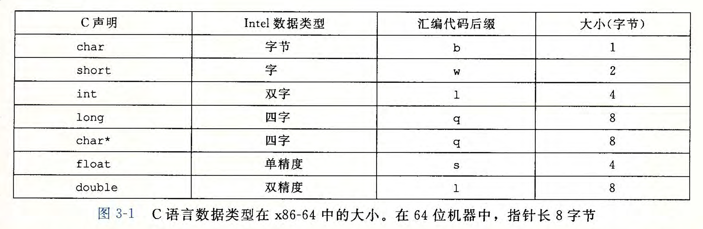
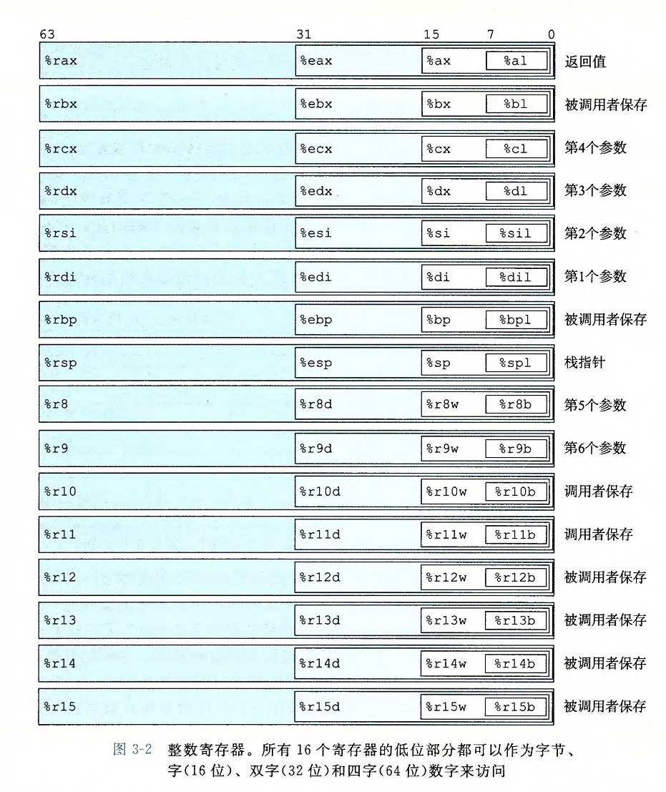
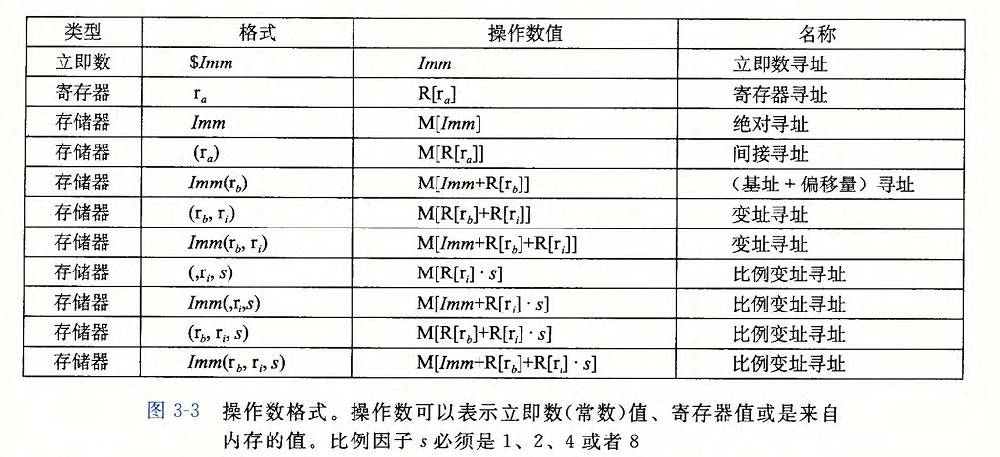

# 程序的机器级表示
- 机器代码：计算机执行的字节编码
- 汇编代码：机器代码的文本表示(GCC C语言编译器以汇编代码的形式输出)
  - GCC再调用汇编器和链接器，根据汇编代码生成机器代码
- 高级语言提供抽象级别更高，开发效率也更高，且可移植性更高(汇编代码跟特定机器密切相关)

## 历史观点
- 处理器的发展史(Intel系列俗称x86)：根据摩尔定律CPU会一直发展，
  - x86-32：32位的处理器
  - x86-64：64位的处理器，现在和以后的机器都会向64位发展，但是会向下兼容

## 程序编码

### 机器级代码
C语言提供了一种模型：可以在内存中声明和分配各种数据类型的对象。
机器级代码：简单的将内存视为一个很大的，按字节寻址的数组
- 机器级编程的两种重要抽象思想
  - ISA(指令集体系结构抽象/指令集架构:Instruction Set Architecture)：将指令描述成按顺序执行的，但CPU是并发的执行多个指令
  - 虚拟地址：将内存模型看作是有一个很大的字节数
- 机器代码与原始C代码差别极大：
  - 程序计数器(PC，%rip)：给出下一条将要执行的指令的内存地址
  - 整数寄存器文件：包含16个可命名的位置(每个位64位)，可以用来储存地址，整数数据，某些重要状态
  - 条形码寄存器：保存着最近执行的算数或者逻辑指令的状态信息。比如实现if-else语句等
  - 向量寄存器：可以存放一个或者多个整数或者浮点数值
- 程序内存：
  1. 程序可执行机器代码
  2. 操作系统的一些信息
  3. 管理过程调用和返回的运行时栈
  4. 用户分配的内存块

### 代码示例(汇编和机器代码)
mstore.c 
- mstore.s：汇编文件(汇编语言)
- mstore.o：二进制格式(机器语言)，无法直接查看。但是有一类反汇编器(disasssembler)的程序可以根据机器代码产生一种类似于汇编代码的格式
         
### 格式注解
Integer register：
- Caller-saved(调用者保存)
- Callee-saved(被调用者保存)

## 数据格式
由于32位是从16位体系结构扩展的，所以Intel用字(word)表示16位的数据类型，那么双字(double words)为32位数，四字(quad words)为64位数
x86-64的C语言数据类型的大小(64位机器中，指针长8字节)

movb(传送字节), movw(传送字), movl(传送双字), movq(传送四字)

## 访问信息
一个x86-64的CPU包含一组16个储存64位值得*通用目的寄存器*(用来储存整数数据和指针)
- 指令可以对这16个寄存器中的低位字节中的数据进行操作。字节级操作可以访问最低字节。

有一组标准的规范控制着如何使用寄存器来管理栈......

### 操作数指示符
指令中的*操作数(operand)*：指示出下一个操作中的*源数据值*(可以以常数形式给出，或者从寄存器或内存中读取)和放置结果的*目的位置*(放在寄存器或者内存中)
操作数的三种类型：
- **立即数(immediate)**：表示常数值
- **寄存器(register)**：表示某个寄存器的内容
- **内存引用**：根据计算出的地址(有效地址)访问某个内存位置
  - *寻址模式*：最常用的形式Imm(rb, ri, s) -》 Imm + R[rb] + R[ri] * s
    - Imm:立即数偏移
    - rb:基址寄存器(必须是64位寄存器)
    - ri:变址寄存器(必须是64位寄存器)
    - s:比例因子(必须是1，2，4，8)

### 数据传送指令

### 数据传送示例
### 压入和弹出栈数据

## 算术和逻辑操作

### 加载有效地址
### 一元和二元操作
### 移位操作
### 讨论
### 特殊的算术操作

## 控制

### 条件码
### 访问条件码
### 跳转指令
### 跳转指令的编码
### 用条件控制来实现条件分支
### 用条件传送来实现条件分支
### 循环
### switch语句

## 过程
## 数组分配和访问
## 异质的数据结构
## 在机器级程序中将控制和数据结合起来
## 浮点代码
## 小结