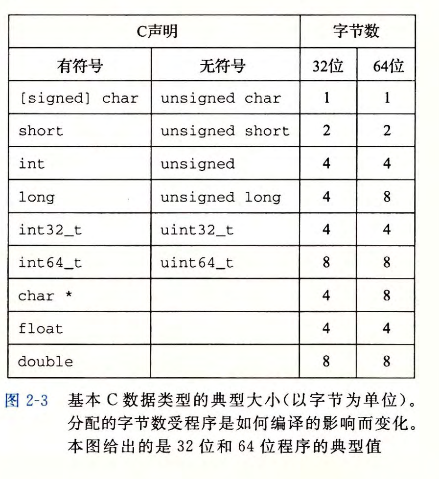

# 信息的表示和处理
- **二值信号**：二进制数字，*位(bit)*
  - 二值信号容易被表示，储存和传输
  - 将位组合起来，再加上某种解释就有含义

- 三种最重要的数字表示
  - 无符号：基于传统的二进制表示法，可以表示 >= 0 的数字
  - 补码：表示有符号整数
  - 浮点数：表示实数的科学计数法的以2为基数的版本
- 问题
  - 溢出(overflow)：计算机以有限的位来表示一个数字的编码，当这个数字的编码太大了，会出现溢出的现象
  - 浮点数的表示是近似的，会损失精度

> C语言的演变的故事
## 信息储存
- 四个抽象概念
 - **最小可寻址的内存单位**：大多数计算机使用8个位的块或者字节(byte)，作为最小可寻址的内存单位
 - **虚拟内存**：机器级程序将内存视为一个非常大的 **字节数组**
 - **地址**：每个字节都有唯一一个数字来标识
 - **虚拟地址空间**：所有可能地址的集合
- 将储存器划分为可管理单元，用来存放不同的 *程序对象*
  - 数据
  - 指令
  - 控制信息

### 十六进制表示法
- 十六进制(hexadecimal)：‘0’ ~ ‘9’ + ‘A(a)’ ~ ‘F(f)’
- 在C语言中以 0x/0X 开头的数字常量被认为是十六进制的值。
- 编写机器级程序有一个常见的任务就是在位模式下，手工转换十进制，二进制，十六进制

### 字数据大小
对于程序员写出可移植程序非常重要。
- 每个计算机都有一个**字长(word size)**，来指明指针数据的**标称大小(nominal size)**。
  - 对于一个w位字长的机器，虚拟地址的范围为：0 ~ 2^w-1 ，程序最多访问2^w 个字节。
- 32位字长的虚拟地址空间为4GB，64位字长的虚拟地址空间为16GB。
近些年，计算机都从32位的字长向64位字长迁移。64位可以运行32位编译的程序，向后兼容。
- 由机器位数不同带来的差异
  - C语言中的典型数据的差异：
  
- 解决差异：
  - ISO C99引入了一类数据类型，其数据大小是固定的，不随编译器和机器设置而变化。例如int32_t(4个字节), int64_t(8个字节)
### 寻址和字节顺序
一个w位的整数，其位表示为[Xw-1, Xw-2,.....X0]，其中Xw-1是最高有效位，X0是最低有效位
- 储存顺序：
  - 小端法：最低有效位在最前面
  - 大端法：最高有效位在最前面(常规认识下的方式)

由于储存顺序是不可见的，但是在一些情况下却不能忽视
1. 网络传输二进制数据时：在不同储存方式的机器间可能会导致数据倒过来的情况。
2. 阅读表示整数数据的字节序列时字节顺序也很重要。通常发生在机器级程序时。
3. 编写规避正常的类型系统的程序
### 表示字符串
- C语言中字符串是一个以'\0'结束的字符数组。通过不同的编码标准表示不同字符
- 文本数据比二进制有更强的平台独立性
> 文本编码：ASCII和Unicode
### 表示代码
- 二进制代码很少能在不同的机器上和操作系统间移植
### 布尔代数简介
因为二进制是计算机编码，储存和操作信息的核心。所以围绕0和1的研究已经演化成了非常丰富的数学知识体系
- ~(NOT)
- &(AND)
- |(OR)
- ^(XOR)

*位向量*：在应用中的例子，指定一个位向量*掩码*.......

### C语言的位级运算
一个简单的例子：
```C
/*通过布尔代数运算，该函数可以实现将两个指针指向的两个值互换*/
void inplace_swap(int* x, int* y) {
  *x = *x ^ *y;
  *y = *x ^ *y;
  *x = *x ^ *y;
}
```

### C语言的逻辑运算
- ||(OR)
- &&(AND)
- !(NOT)

### C语言的位移运算
C语言提供的移位运算
- \>\>(算数左移，首位添加0)
- <<(算数右移，末尾添加0)

## 整数的表示

### 整数数据类型
### 无符号树数的编码
### 补码编码
### 有符号数和无符号数的转换
### C语言中的有无符号数
### 扩展一个数字的位表示
### 截断数字
### 关于有符号数和无符号数的建议

## 整数的运算


## 浮点数


## 小结